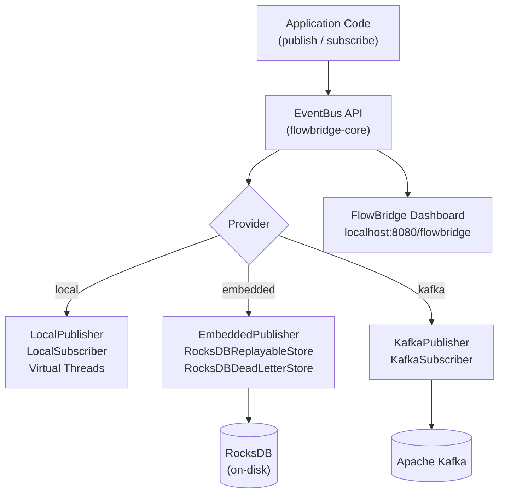

<div align="center">

<h1>⚡ FlowBridge</h1>

<p><strong>A lightweight, embeddable event bus for Spring Boot applications.</strong><br/>
Start simple. Migrate to Kafka — without changing a single line of application code.</p>

[](https://openjdk.org/projects/jdk/21/)
[](https://spring.io/projects/spring-boot)
[](https://maven.apache.org/)
[](LICENSE)

</div>

---

## Why FlowBridge?

Most event-driven frameworks force you to choose your infrastructure upfront. FlowBridge lets you **start with zero dependencies** and grow at your own pace:

| Stage | Provider | What you get |
|-------|----------|--------------|
| 🚀 **MVP / Dev** | `local` | In-memory, Virtual Threads, zero config |
| 🌱 **Production small** | `embedded` | RocksDB persistence, replay, Dead Letter Queue |
| 🏢 **Scale** | `kafka` | Drop Kafka in via config alone |

Switch providers by changing **one line** in `application.yml`. Application code never changes.

---

## ⚡ Quickstart — 60 seconds to your first event

### 1. Add the dependency

```xml
<dependency>
    <groupId>org.flowbridge</groupId>
    <artifactId>flowbridge-spring-boot-starter</artifactId>
    <version>1.0.0-SNAPSHOT</version>
</dependency>
```

### 2. Configure your provider

```yaml
# application.yml
flowbridge:
  provider: local   # local | embedded | kafka
```

### 3. Publish an event

```java
@Service
public class OrderService {

    private final EventBus eventBus;

    public OrderService(EventBus eventBus) {
        this.eventBus = eventBus;
    }

    public void placeOrder(Order order) {
        // ... save order to DB ...
        eventBus.publish("orders.placed", new OrderPlacedEvent(order.getId()));
    }
}
```

### 4. Subscribe with an annotation

```java
@Service
public class InventoryService {

    @FlowBridgeListener(topic = "orders.placed")
    public void onOrderPlaced(OrderPlacedEvent event) {
        // Runs on a Java 21 Virtual Thread — non-blocking by default
        inventory.decrementStock(event.getOrderId());
    }
}
```

That's it. **No brokers, no serialization config, no XML.**

---

## 🛠️ Step-by-Step Guide: Implementing FlowBridge in Any Project

Follow these steps to integrate and run FlowBridge inside your own Spring Boot application:

### Step 1: Install FlowBridge to your local Maven Cache
Since FlowBridge is custom-built and might not be published to Maven Central, you must first build and install the modules to your local `.m2` repository:
```bash
# Run this from the root of the FlowBridge source directory
mvn clean install -DskipTests
```

### Step 2: Add starter dependency to your project's pom.xml
In your Spring Boot application's `pom.xml`, add the dependency for the auto-configuration starter:
```xml
<dependency>
    <groupId>org.flowbridge</groupId>
    <artifactId>flowbridge-spring-boot-starter</artifactId>
    <version>1.0.0-SNAPSHOT</version>
</dependency>
```

#### Add dashboard (Optional)
If you want to use the Thymeleaf-based web dashboard, also include these dependencies:
```xml
<dependency>
    <groupId>org.flowbridge</groupId>
    <artifactId>flowbridge-dashboard</artifactId>
    <version>1.0.0-SNAPSHOT</version>
</dependency>
<dependency>
    <groupId>org.springframework.boot</groupId>
    <artifactId>spring-boot-starter-thymeleaf</artifactId>
</dependency>
```

### Step 3: Choose and Configure your Provider
In your project's `application.yml` (or `application.properties`), define which backend adapter FlowBridge should load.

#### Option A: Local Provider (In-Memory, Zero Broker)
Best for local development, fast startup, and local tests.
```yaml
flowbridge:
  provider: local
```

#### Option B: Embedded Provider (RocksDB Persistence)
Best for single-instance applications needing durable delivery, Dead Letter Queue management, and event replay support without deploying external brokers.
```yaml
flowbridge:
  provider: embedded
  embedded:
    data-dir: ./data/flowbridge  # Local directory where RocksDB files will be created
```

#### Option C: Kafka Provider (Distributed Broker)
Best for distributed environments and high scale.
1. First, make sure you add the Kafka module to your `pom.xml`:
   ```xml
   <dependency>
       <groupId>org.flowbridge</groupId>
       <artifactId>flowbridge-kafka</artifactId>
       <version>1.0.0-SNAPSHOT</version>
   </dependency>
   ```
2. Then configure the bootstrap servers and consumer group in your properties:
   ```yaml
   flowbridge:
     provider: kafka
     kafka:
       bootstrap-servers: localhost:9092
       group-id: my-service-group
       topic-prefix: myapp         # Optional namespace prefix (e.g. results in myapp.orders)
   ```

### Step 4: Define your Event Payload (POJO)
Define any plain old Java object (POJO) as your event message. FlowBridge uses schema-less Protostuff serialization, so you do not need to implement any interface or define schema files.
> [!IMPORTANT]
> The event payload class **MUST** have a zero-argument (default) constructor so that it can be correctly deserialized.

```java
package com.example.event;

public class OrderPlacedEvent {
    private String orderId;
    private double totalAmount;

    // Default constructor is mandatory
    public OrderPlacedEvent() {}

    public OrderPlacedEvent(String orderId, double totalAmount) {
        this.orderId = orderId;
        this.totalAmount = totalAmount;
    }

    public String getOrderId() { return orderId; }
    public void setOrderId(String orderId) { this.orderId = orderId; }
    public double getTotalAmount() { return totalAmount; }
    public void setTotalAmount(double totalAmount) { this.totalAmount = totalAmount; }
}
```

### Step 5: Publish Events using EventBus
Inject `org.flowbridge.core.application.port.in.EventBus` into your Spring beans and invoke `publish(topic, payload)`:
```java
package com.example.service;

import org.flowbridge.core.application.port.in.EventBus;
import com.example.event.OrderPlacedEvent;
import org.springframework.stereotype.Service;

@Service
public class OrderService {

    private final EventBus eventBus;

    public OrderService(EventBus eventBus) {
        this.eventBus = eventBus;
    }

    public void placeOrder(String orderId, double amount) {
        OrderPlacedEvent event = new OrderPlacedEvent(orderId, amount);
        
        // Publishes the event to "orders.placed" topic
        eventBus.publish("orders.placed", event);
    }
}
```

### Step 6: Listen to Events using `@FlowBridgeListener`
Annotate any method on a Spring-managed component (e.g. `@Service`, `@Component`) with `@FlowBridgeListener`. 
- The annotated method must accept exactly one parameter, matching your event payload type.
- All delivery runs asynchronously on Java 21 **Virtual Threads** by default.

```java
package com.example.listener;

import org.flowbridge.starter.FlowBridgeListener;
import com.example.event.OrderPlacedEvent;
import org.springframework.stereotype.Component;

@Component
public class InventoryListener {

    @FlowBridgeListener(topic = "orders.placed")
    public void reserveStock(OrderPlacedEvent event) {
        System.out.println("Processing stock reservation for: " + event.getOrderId());
        // Handle database work, API calls etc. safely (virtual thread handles blocking operations)
    }
}
```

### Step 7: Access the Dashboard & Monitor Events
If you enabled the dashboard in **Step 2**, start your application and open **`http://localhost:8080/flowbridge`** in your browser. You can:
1. View live statistics of active subscribers and published message counts.
2. View and retry dead-lettered events (when using the `embedded` provider).
3. Trigger event replay from the beginning (`ALL`), from a specific offset, or from a timestamp.

---

## Architecture



### Key design principles

- **Hexagonal architecture** — `EventBus` is the only port your application code touches. Providers are adapters behind it.
- **Zero-change migration** — the `flowbridge.provider` property selects the adapter at startup. No code changes required.
- **Virtual Threads first** — all local and embedded delivery runs on Java 21 Virtual Threads for maximum throughput with minimal resource usage.
- **Protostuff serialization** — fast, schema-less Protocol Buffer serialization of any POJO. No `.proto` files needed.

---

## Provider Comparison

| Feature | `local` | `embedded` | `kafka` |
|---------|---------|------------|---------|
| Setup required | None | None | Kafka cluster |
| Message persistence | ❌ | ✅ RocksDB | ✅ |
| Replay from offset | ❌ | ✅ | ✅ |
| Replay from timestamp | ❌ | ✅ | ✅ |
| Dead Letter Queue | ❌ | ✅ | ✅ |
| Dashboard | ✅ (live topics) | ✅ (full metrics) | Planned |
| External dependencies | None | None | Kafka |
| Best for | Dev / tests | Small prod / indie | High-scale prod |

---

## Configuration Reference

### Core

```yaml
flowbridge:
  provider: local          # local | embedded | kafka  (default: local)
```

### Embedded Provider

```yaml
flowbridge:
  provider: embedded
  embedded:
    data-dir: ./data/flowbridge   # RocksDB storage directory
```

### Kafka Provider

```yaml
flowbridge:
  provider: kafka
  kafka:
    bootstrap-servers: localhost:9092
    group-id: my-service
    topic-prefix: myapp          # Optional prefix for all topics
```

---

## Dashboard

When you add `flowbridge-dashboard` to your project, a management UI is automatically available at **`http://localhost:8080/flowbridge`**.

> The dashboard requires `spring-boot-starter-thymeleaf` on the classpath.

```xml
<dependency>
    <groupId>org.flowbridge</groupId>
    <artifactId>flowbridge-dashboard</artifactId>
    <version>1.0.0-SNAPSHOT</version>
</dependency>
```

### What the dashboard shows

- **Active Topics** — all subscribed and persisted topics with subscriber status, persistence status, and message counts
- **Dead Letter Queue** — failed events with error messages; retry or discard with one click
- **Replay Panel** — trigger event replay for any topic using `ALL`, `FROM_OFFSET`, or `FROM_TIMESTAMP` modes
- **Provider badge** — shows the currently active provider

---

## Running the Example App

The `flowbridge-examples` module contains a complete **Order Processing Service** demonstrating all providers.

### Local mode (default — no dependencies)

```bash
cd flowbridge-examples
mvn spring-boot:run
```

### Embedded mode (RocksDB — persistence + DLQ + replay)

```bash
cd flowbridge-examples
mvn spring-boot:run -Dspring-boot.run.profiles=embedded
```

### Try it

```bash
# Place a successful order (delivered to InventoryService + NotificationService)
curl -s -X POST http://localhost:8080/orders \
  -H "Content-Type: application/json" \
  -d '{"customerId":"C-001","amount":49.99}' | jq

# Publish to the failing topic (lands in DLQ)
curl -s -X POST http://localhost:8080/orders/fail \
  -H "Content-Type: application/json" \
  -d '{"customerId":"C-002","amount":99.99}' | jq

# Open the dashboard
open http://localhost:8080/flowbridge
```

---

## Docker Compose

Run the example in **embedded mode** with a persistent RocksDB volume:

```bash
docker compose up --build
```

The container exposes port `8080` with:
- `POST /orders` — place an order
- `POST /orders/fail` — trigger a DLQ event
- `GET /flowbridge` — dashboard
- `GET /actuator/health` — healthcheck

To stop and clean up:

```bash
docker compose down -v
```

---

## Module Reference

| Module | Artifact | Description |
|--------|----------|-------------|
| `flowbridge-core` | `flowbridge-core` | Domain models, `EventBus` API, port interfaces, Protostuff serializer |
| `flowbridge-local` | `flowbridge-local` | In-memory provider using Virtual Threads |
| `flowbridge-embedded` | `flowbridge-embedded` | RocksDB-backed provider with replay and DLQ |
| `flowbridge-kafka` | `flowbridge-kafka` | Apache Kafka provider (structure ready) |
| `flowbridge-spring-boot-starter` | `flowbridge-spring-boot-starter` | Auto-configuration, `@FlowBridgeListener` annotation |
| `flowbridge-dashboard` | `flowbridge-dashboard` | Thymeleaf web dashboard at `/flowbridge` |
| `flowbridge-examples` | `flowbridge-examples` | Order Processing demo application |

---

## Building from Source

```bash
# Clone the repo
git clone https://github.com/your-org/flowbridge.git
cd flowbridge

# Build and run all tests
mvn clean test

# Package (skip tests for speed)
mvn clean package -DskipTests

# Run the example
java -jar flowbridge-examples/target/flowbridge-examples-*.jar
```

---

## Technology Stack

| Concern | Technology |
|---------|-----------|
| Language | Java 21 |
| Framework | Spring Boot 3.x |
| Build | Apache Maven |
| Serialization | Protostuff (schema-less Protocol Buffers) |
| Persistence | RocksDB |
| Concurrency | Java 21 Virtual Threads |
| Dashboard | Thymeleaf |
| Testing | JUnit 5, Mockito, Testcontainers |
| Containerization | Docker, Docker Compose |

---

## Contributing

Contributions are welcome! Here's how to get started:

1. Fork the repository
2. Create a feature branch: `git checkout -b feature/my-feature`
3. Make your changes and add tests
4. Run the full test suite: `mvn clean test`
5. Open a Pull Request

Please follow the existing code style (hexagonal architecture, no framework coupling in core modules).

---

## License

[Apache License 2.0](LICENSE)

---

<div align="center">
<sub>Built with ☕ and Virtual Threads · Made for indie hackers, startups, and small teams</sub>
</div>
